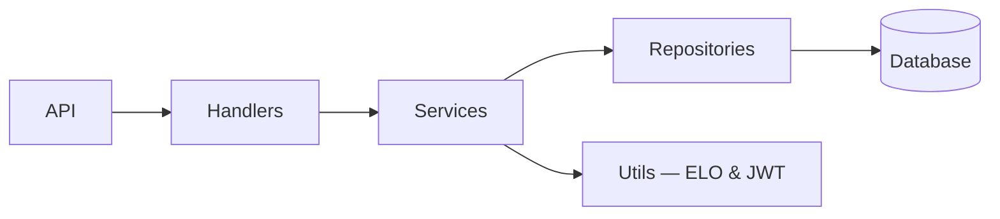

# ⚽ liga — учёт матчей и рейтингов

Кратко
`liga` — лёгкий и расширяемый REST-сервис для учёта матчей, игроков и таблиц сезона. Поддерживает подсчёт рейтингов (ELO), seed-данные и API для интеграции с фронтендом или админкой.

Getting Started

Prerequisites
- Go >= 1.18
- Git
- (Опционально) Docker, Make

Installation
```bash
git clone https://github.com/your-org/liga.git
cd liga
go mod download
```

Running
- Локально (быстро):
```bash
go run cmd/liga/main.go
```
- Сборка и запуск бинарника:
```bash


# ⚽ liga — учёт матчей и рейтингов

Кратко
`liga` — лёгкий REST-сервис для учёта матчей, игроков и таблиц сезона. Сервис хранит результаты, считает рейтинги (ELO) и предоставляет REST API для интеграции с фронтом или админкой.

Getting Started

Prerequisites
- Go >= 1.18
- Git
- (Опционально) Docker, Make

Installation
```bash
git clone https://github.com/your-org/liga.git
cd liga
go mod download
```

Running
- Быстро (локально):
```bash
go run cmd/liga/main.go
```
- Сборка и запуск бинарника:
```bash
go build -o bin/liga ./cmd/liga
./bin/liga
```
- Запустить seed-данные:
```bash
go run cmd/seed/main.go
```

Notes
- Точки входа: [cmd/liga/main.go](cmd/liga/main.go), [cmd/seed/main.go](cmd/seed/main.go).
- Конфигурация: смотрите [internal/config/database.go](internal/config/database.go).

Additional commands
- Тесты:
```bash
go test ./...
```
- Форматирование и линт:
```bash
gofmt -w .
golangci-lint run
```
- Docker (если есть Dockerfile):
```bash
docker build -t liga:latest .
docker run -p 8080:8080 liga:latest
```

Contributors
- 👨‍💻 Adam Gowz — основной автор
- 🤝 PRs и issues приветствуются

Ключевая технология
- Язык: Go — быстрый и статически типизированный, подходит для серверов.
- JWT: реализовано в [utils/jwt.go](utils/jwt.go).
- ELO: расчёт в [utils/elo/elo.go](utils/elo/elo.go).

Feedback
- Откройте issue в репозитории или пишите на developer@your-email.example (замените на реальный).

Примеры запросов
```http
GET /matches?from=2025-01-01&to=2025-12-31
GET /matches?season_id=1&from=2024-12-25&to=2025-01-25
GET /matches?player_id=5&from=2024-12-20&to=2024-12-25
```


